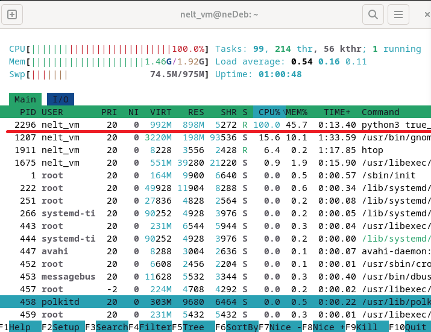
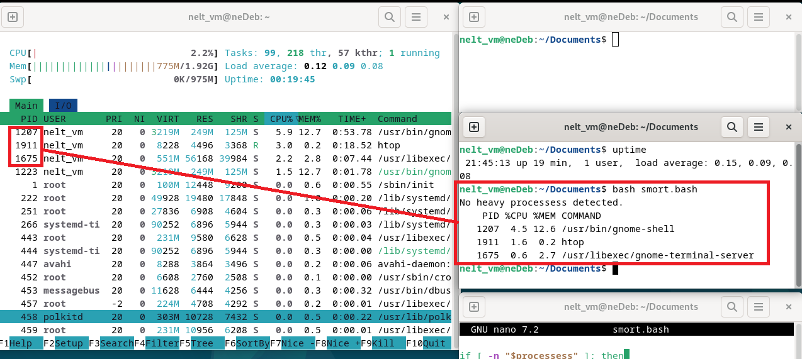
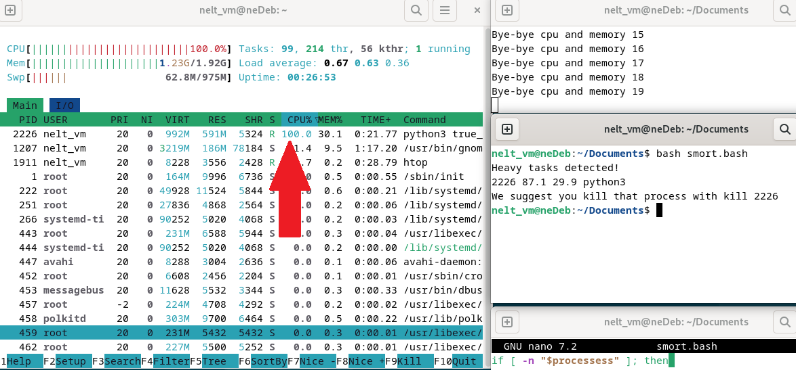
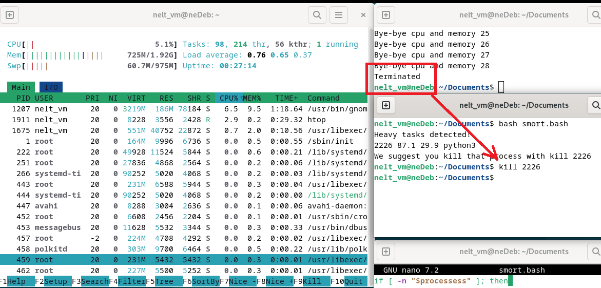

# Лабораторная работа №6

## Тема: Мониторинг ресурсов

## Цель работы

Научиться анализировать использование ресурсов системы. 
Управлять ресурсами для облегчения нагрузки на систему.

## Ход работы

1) Установил утилиту htop на свою виртуальную машину
2) Написал программу на python, которая будет создавать высокую нагрузку на систему

```python
i = 0
while True:
    print(f"Bye-bye cpu and memory {i}")
    bytearray(512000000)
    bytearray(512000000)
    bytearray(512000000)
    bytearray(512000000)
    bytearray(512000000)
    bytearray(512000000)
    bytearray(512000000)
    bytearray(512000000)
    some_str = ' ' * 512000000
    i += 1
```

Собственно, система нагружена и интерфейс виртуальной машины уже начал подлагивать



3) Написал bash скрипт, проверяющий нагрузку и выдающий рекомендацию по уменьшению нагрузки на систему

```bash
    #!/bin/bash
    
    #Собираем информацию о процессах, которые нагружают cpu или mem больше, чем на 50%
    processess=$(ps -eo pid,%cpu,%mem,command --sort=-%cpu,-%mem | awk '$2 > 50 || $3 > 50 {print $1, $2, $3, $4}')
    
    # Проверяем, есть ли тяжелые процессы
    if [ -n "$processess" ]; then
        echo "Heavy processes detected!"
        echo "$processess"
        pid=$(echo "$processess" | awk 'NR==1 {print $1}')
        echo "We suggest you kill that process with: kill $first_pid"
    else
        # Если тяжелых процессов нет, выводим топ-3 самых тяжких процесса и (первая строчка) заголовок
        echo "No heavy processes detected."
        ps -eo pid,%cpu,%mem,command --sort=-%cpu,-%mem | head -n 4
    fi
```

Работа программы без утяжелителей:



Тяжелый процесс запущен:



Уничтожаем процесс:


